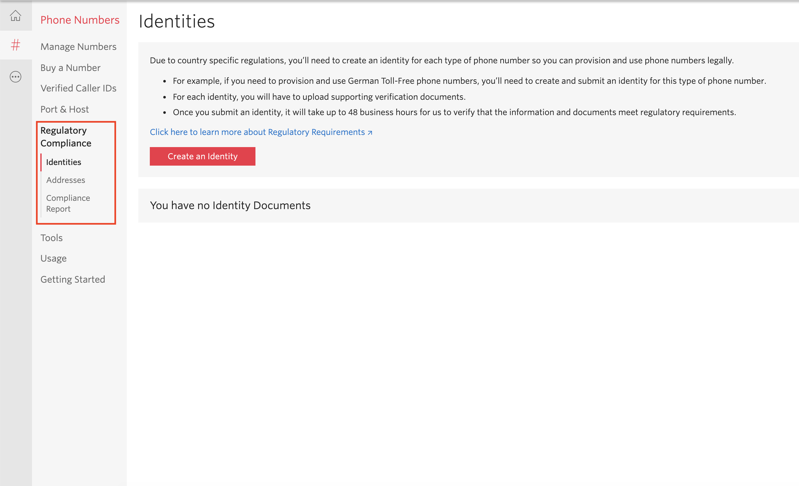
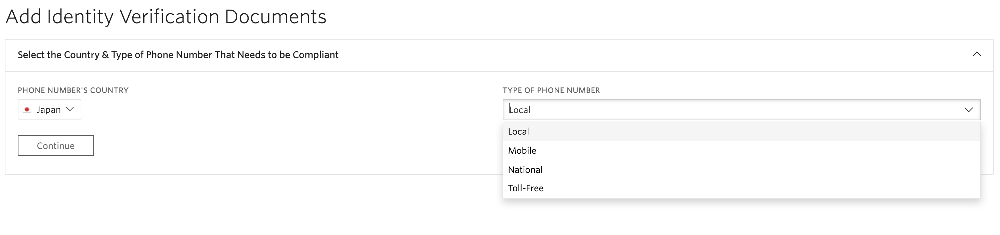
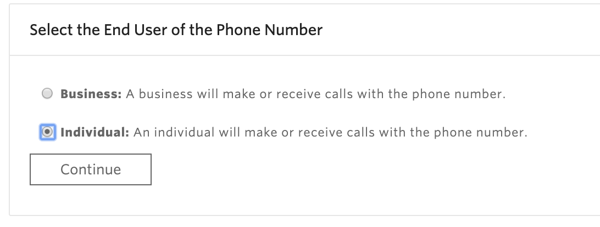
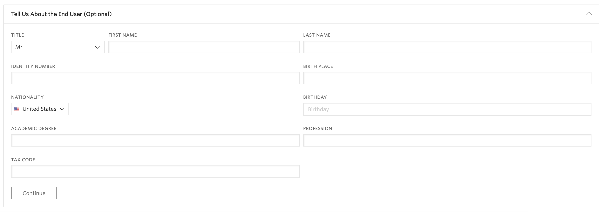
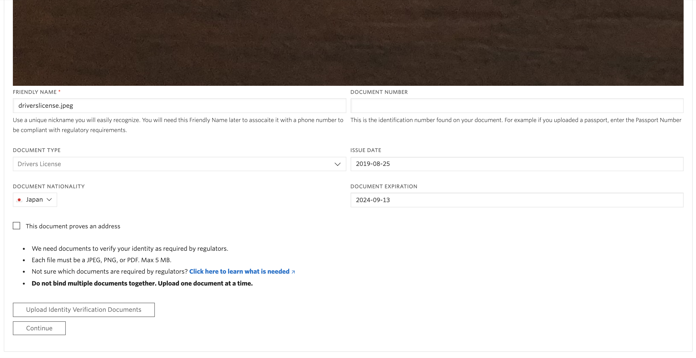
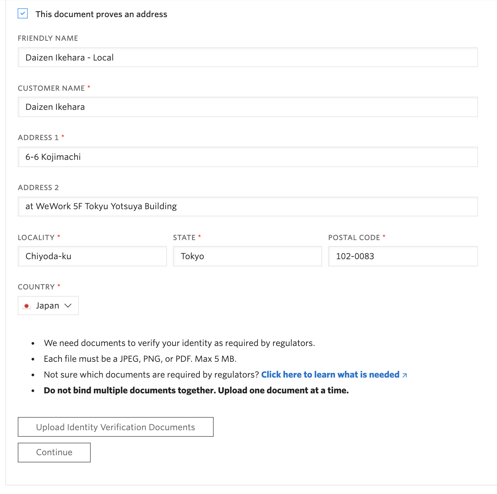
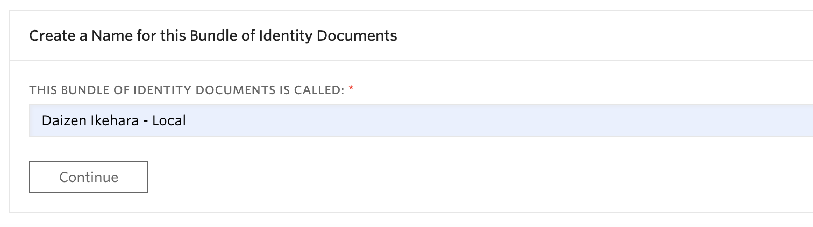
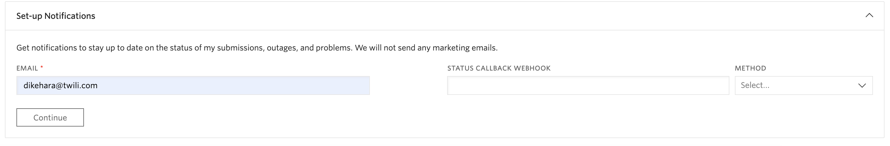
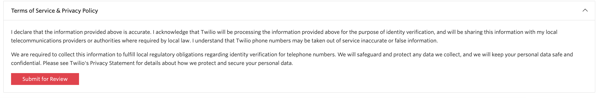

#  本人情報（IdentitySid）、住所情報（AddressSid）の登録方法
## はじめに
電話番号における各国の規制強化の流れに則り2019年11月20日より、コンソールから日本の電話番号を取得する場合は本人情報（IdentitySid）、住所情報（AddressSid）を本人確認書類と共に登録する必要があります。このドキュメントでは登録方法の一例をご紹介します。

## 1-1. コンソールにアクセス
[Twilioホームページ](https://www.twilio.com/)をブラウザーで開き、[LOG IN](https://www.twilio.com/login) をクリックするか、[コンソール](https://www.twilio.com/console)に直接移動します。

## 1-2. Phone Numbersダッシュボードにアクセス
コンソールのサイドバーから __All Products & Services__ をクリックすると、サイドバーが展開されます。そこで __Phone Numbers__ をクリックします。

## 1-3. コンプライアンス情報を表示し、本人情報を登録
Phone NumberのメニューからRegulatory Complianceを選択し、__Create an Identity__ ボタンをクリックします。

登録する国を選択し、この情報に紐づく電話番号の種類を選択します。購入する電話番号の種類ごとに登録する必要があります。

続けて電話番号を使用するエンドユーザー情報を登録します。企業として事業で利用する場合は __Business__ を、検証や開発に利用する場合は __Individual__ を選択します。

さらに任意でエンドユーザー情報を入力します。

ここで、免許証やパスポートなどの本人確認書類をアップロードするため、__Upload Identity Verification Documents__ ボタンをクリックします。

本人確認書類は5MBまでのPNG,JPEG,PDFをアップロード可能です。複数のドキュメントをアップロードする場合は１つのファイルにせず、別個にアップロードが必要です。
どのような書類が必要なのかについては [こちら](https://www.twilio.com/guidelines/regulatory)を確認してください。

それぞれの項目の簡単な説明はこちらです。

|項目名|説明|記入例|
|:--|:--|:--|
|FRIENDLY NAME|ドキュメントを表す一意の名前|Daizen - Drivers License|
|DOCUMENT TYPE|ドキュメントの種類|Drivers License|
|DOCUMENT NATIONALITY|発行国|Japan|
|DOCUMENT NUMBER|パスポート番号など発行された番号|123456789|
|ISSUE DATE|発行日|2019-08-25|
|DOCUMENT EXPIRATION|有効期限日|2024-08-13

また、アップロードしたドキュメントに住所情報が含まれている場合は、併せて __AddressSid__ を登録できます。その場合は、__This document proves an address__ をクリックします。

## 1-4. 住所を登録
ここでは、アップロードしたドキュメントに基づいて住所を登録します。

それぞれの項目の簡単な説明はこちらです。

|項目名|説明|記入例|
|:--|:--|:--|
|FRIENDLY NAME|住所を表す一意の名前|Daizen Ikehara - Local|
|CUSTOMER NAME|氏名|Daizen Ikehara|
|ADDRESS 1|住所1|6-6 Kojimachi|
|ADDRESS 2|住所2（ビル名など）|at WeWork 5F Tokyu Yotsuya Building|
|LOCALITY |市区町村|Chiyoda-ku|
|STATE|都道府県|Tokyo|
|POSTAL CODE|郵便番号|102-0083|
|COUNTRY|国|Japan|
  

## 1-5. 本人情報名を設定

入力を終えたのちに、Continueをクリックし、この本人情報の名前を指定します。

## 1-6. 連絡先情報を設定

本人確認プロセスのステータスが更新された際や、確認に追加情報が必要な場合などに連絡できるEmailアドレスや、Webhookエンドポイントなどを指定します。最低限Emailアドレスを設定してください。

## 1-7. サービス提供情報とプライバシーポリシーに同意し、情報を提出

サービス提供条件、およびプライバシーポリシーを確認し、同意できる場合は __Submit for Review__ をクリックし、レビュープロセスを開始します。

## 関連リソース

- [法令情報（英語）](https://www.twilio.com/guidelines/jp/regulatory)