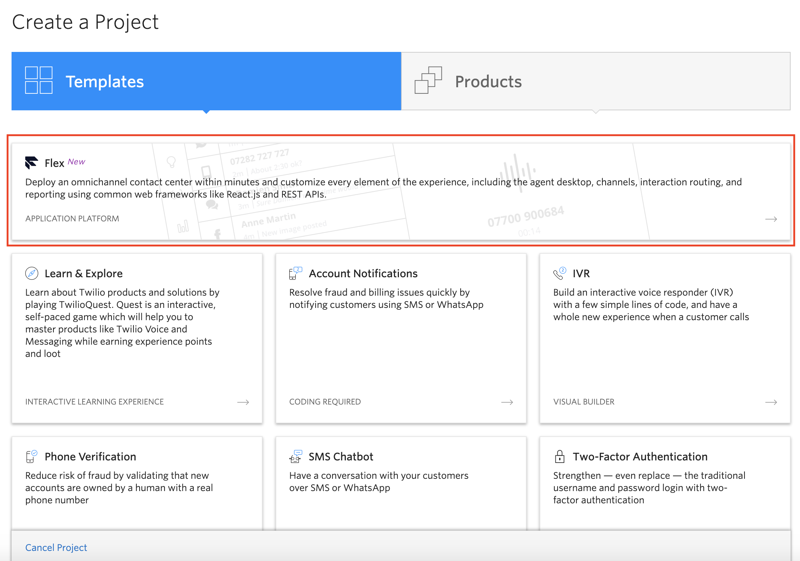
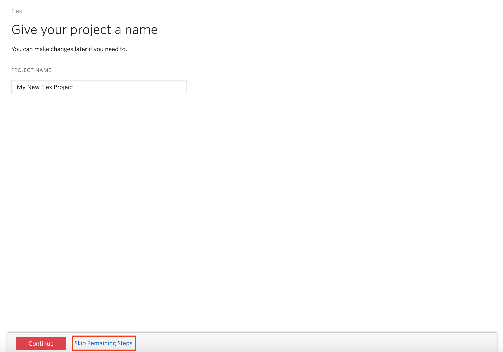
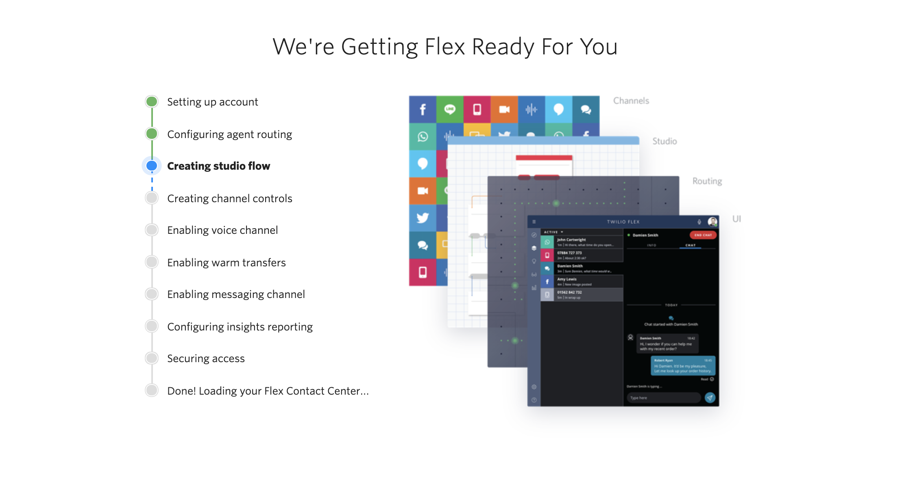
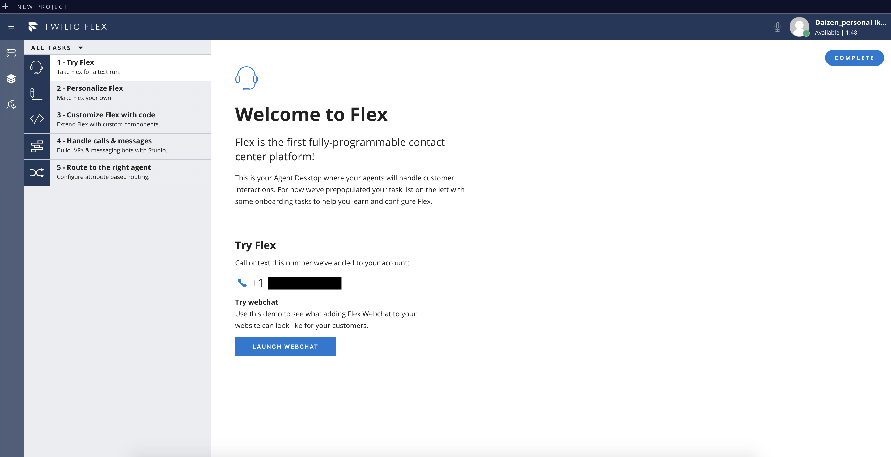

#  手順2: Flexプロジェクトの作成
## はじめに
この手順では、TwilioコンソールからFlexプロジェクト作成します。
作成は5分ほどで完了します。

## 2-1. コンソールにアクセス
[Twilioホームページ](https://www.twilio.com/)をブラウザーで開き、[__LOG IN__](https://www.twilio.com/login) をクリックするか、[コンソール](https://www.twilio.com/console)に直接移動します。

## 2-2. Flexプロジェクトを作成
ページページ左上をクリックするとアカウントに紐づけられたプロジェクトの一覧が表示されます。ここで __Create New Project__ をクリックし、新しいプロジェクトの作成画面を表示します。

テンプレートが表示されている中から、__Flex__ を選択します。

複数人で開発する場合は招待するメンバーなどを指定できますが、このハンズオンでは任意のプロジェクト名を設定し、ボタンではなく、リンクの __skip remaining steps__ を選択します。

自動的にFlexインスタンスのセットアップとデプロイが開始されます。この処理は数分程度で完了します。

初期化が完了すると、__flex.twilio.com__ にリダイレクトされ、デプロイされた環境が表示されます。

## 次の手順
[手順3: 本人情報の登録](./01-03-RegisterIdentity.md)