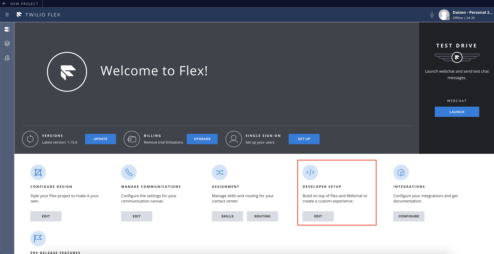
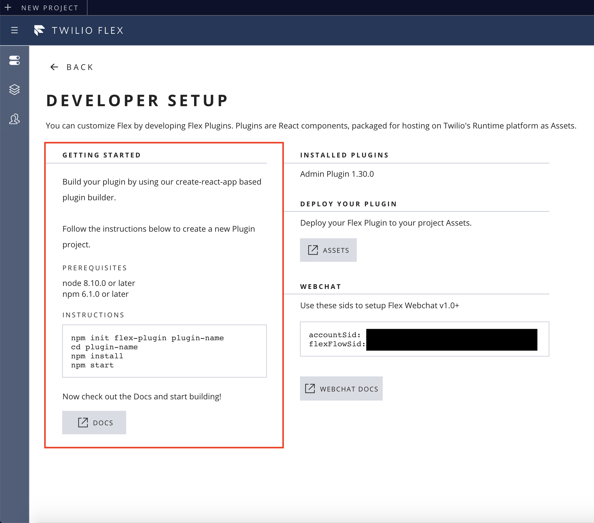
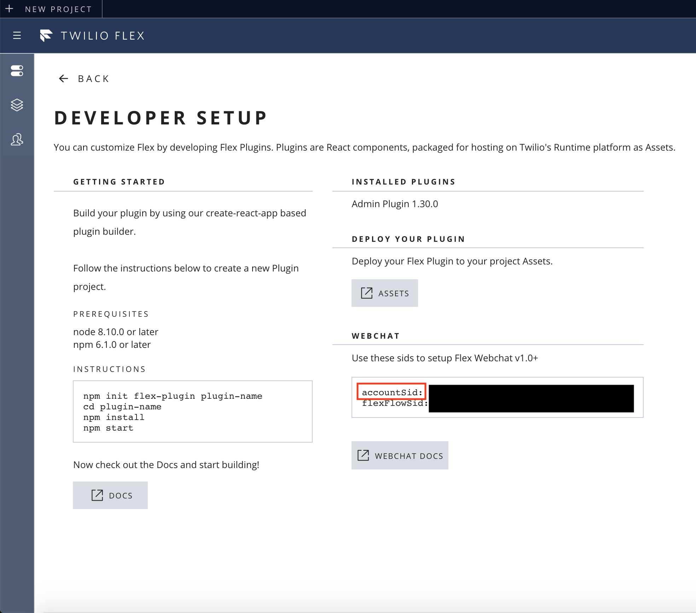
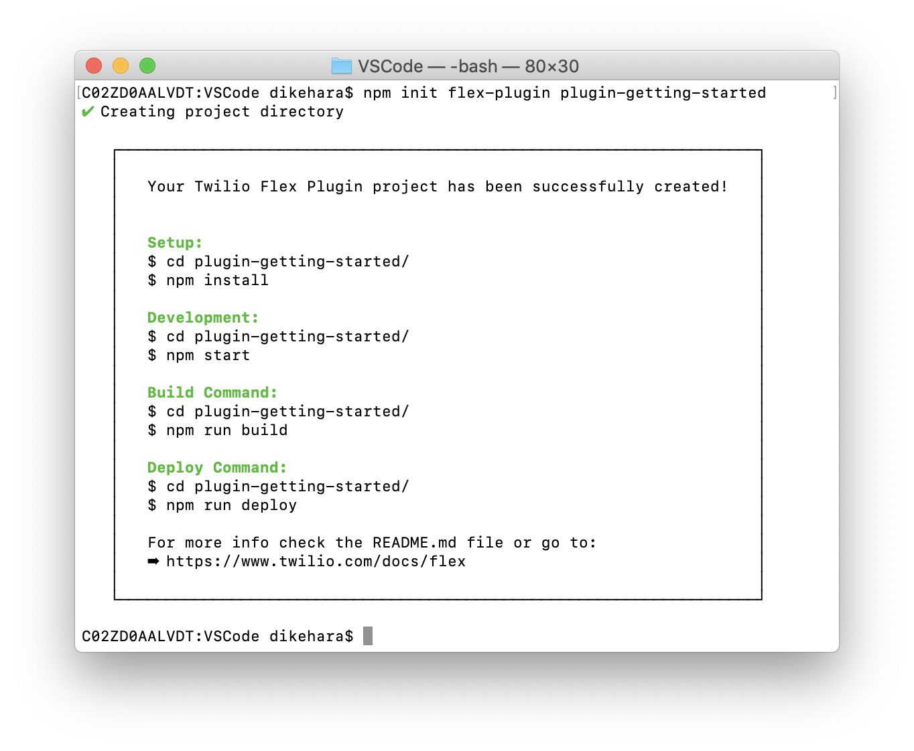
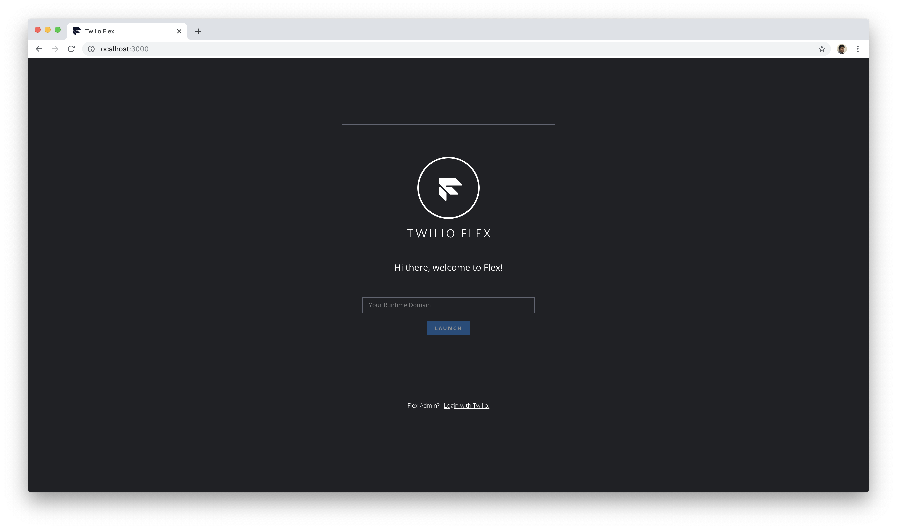
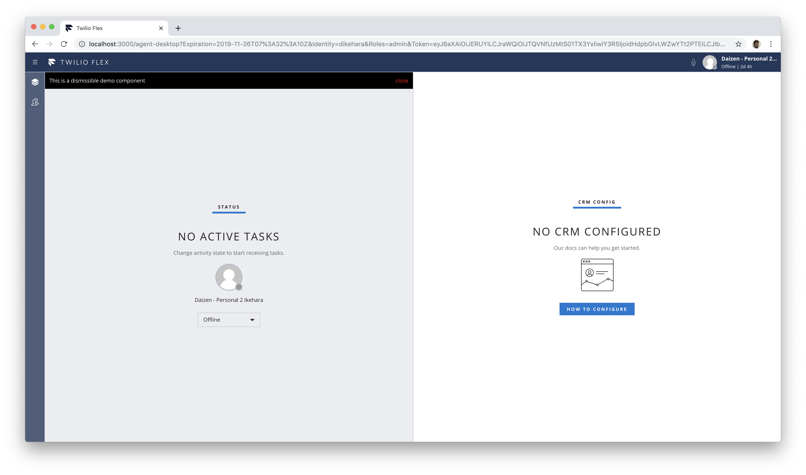

#  手順1: Flexプラグイン開発環境のセットアップ
## はじめに
この手順ではFlexの管理者画面にログインし、Flexプライグインを開発するための環境をセットアップします。

## 1-1. Flexの管理者画面にログイン
flex.twilio.com をブラウザーで開きます。サインイン画面が表示された場合は、画面下部の __Login with Twilio__ をクリックし、Twilioアカウントでサインインします。



## 1-2. 開発環境のセットアップ
サインインが成功すると管理者画面が表示されます。いくつか設定項目が表示されていますが、__DEVELOPER SETUP__ の __EDIT__ ボタンをクリックします。

この画面には、Flexプラグインを開発するための環境情報が記載されています。インストールされているバージョンによって必要環境は異なりますが、今回のスクリーンショットでは、__node 8.10.0以降__、__npm 6.1.0以降__ が必要であることがわかります。



次にターミナルを開き、下記のコマンドでCLIツールのインストールと、プラグイン用のプロジェクトを作成します。__plugin-__ から名前が始まる必要があります。その後は任意の名前に置き換えてください。
```
npm init flex-plugin plugin-プラグイン名
```

プラグインの作成中に __AccountSid__ の入力を求められた場合は、同じ画面から確認することができます。



正しく作成が完了できていれば下記のようにターミナルに表示されます。




下記のコマンドを実行し、作成したフォルダに移動、パッケージのインストール、プロジェクトの実行を行います。

```
cd plugin-プラグイン名
npm install
npm start
```

ブラウザーが開き、ローカル環境からFlexにアクセスすることができるようになります。ここで先ほど同様に画面下部の __Login with Twilio__ をクリックし、Twilioアカウントでサインインします。



サインイン後の画面を確認してください。



## 次の手順
[手順3: UIのローカリゼーション](./02-02-Localization.md)
