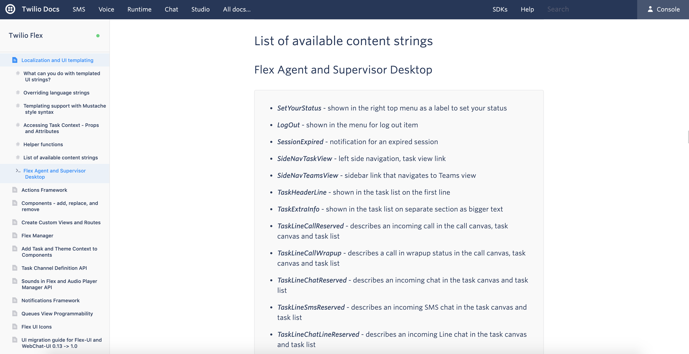
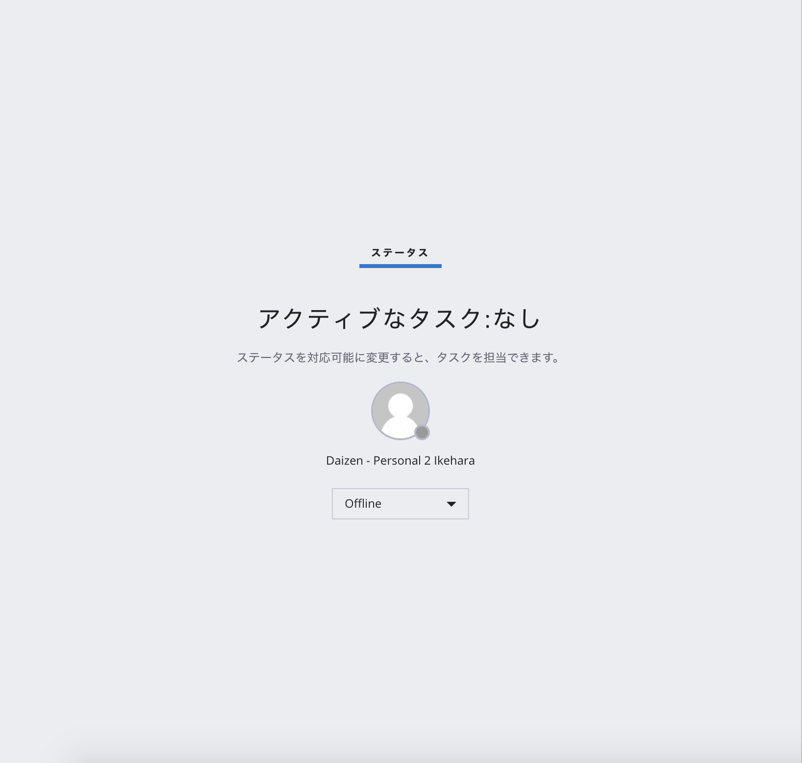
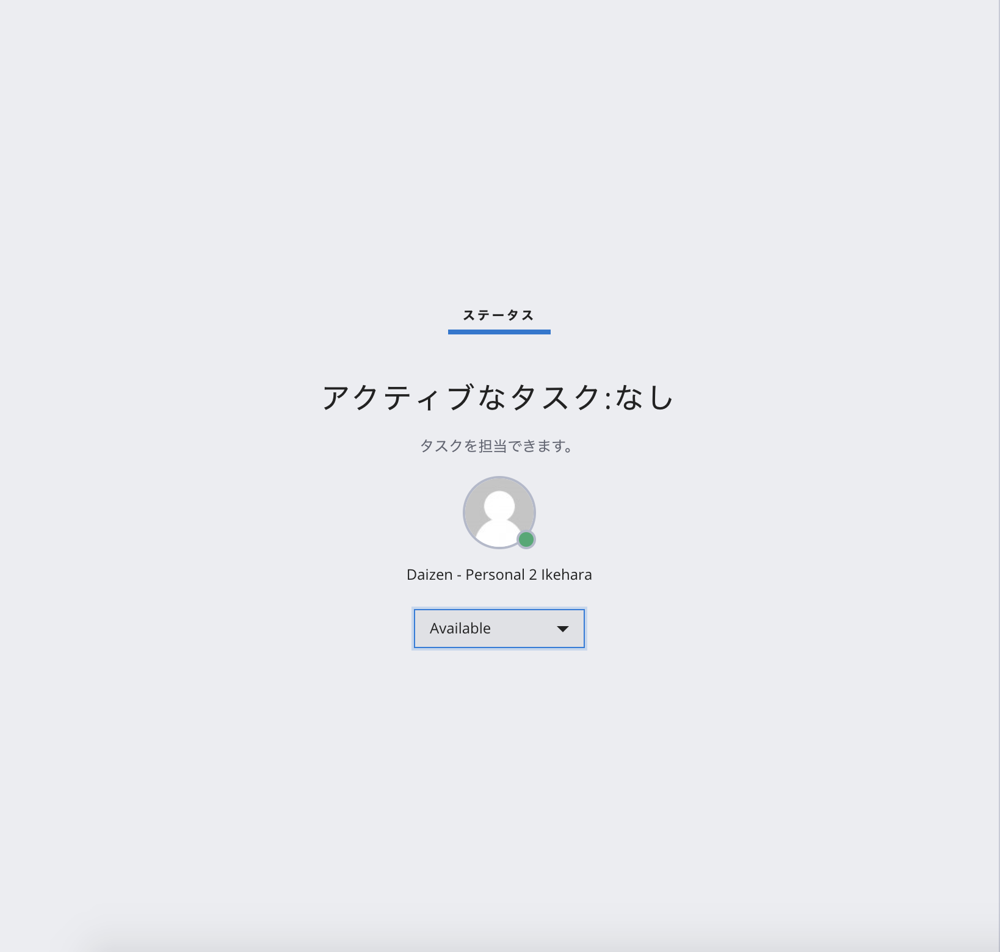

#  手順2: UIのローカリゼーション
## はじめに
この手順ではFlexで提供されている文字列のローカリゼーション方法について学習します。この手順では __Visual Studio Code__ をコードエディターとして利用していますが、任意のエディターを利用いただいて構いません。

## 1-1. 変更可能な文字列を確認

Twilio Flexのドキュメントにはプラグインで[カスタマイズ可能な文字列の一覧](https://www.twilio.com/docs/flex/localization-and-ui-templating#list-of-available-content-strings)が記載されています。



## 1-2. 文字列のカスタマイズ

今回のハンズオンでは、タスクを担当していない場合に表示される文言をローカライズします。それぞれ、下記のような文言に設定することとします。

|文字列名|説明|設定値|
|:--|:--|:--|
|NoTasksTitle|エージェントにタスクがアサインされていない場合に<br>表示されるセクションのタイトル|ステータス|
|NoTasks|メインテキスト|アクティブなタスク:なし|
|NoTasksHintNotAvailable|エージェントがオフラインの際に表示されるヒント文|ステータスを対応可能に変更すると、タスクを担当できます。|
|NoTasksHintAvailable|エージェントが対応可能（Available）状態の際に表示されるヒント文|タスクを担当できます。|

文字列をカスタマイズする場合は、__プラグイン名+Plugin.js__ と名前がついたファイル（今回は __GettingStartedPlugin.js__ となります。このハンズオンではこのファイル名を説明の中で使用しています。）を開き、__init__ メソッドで、引数として渡される __manager__ の __string__ をオーバーライドします。

```js
  init(flex, manager) {
    manager.strings.NoTasksTitle = "ステータス";
    manager.strings.NoTasks = "アクティブなタスク:なし";
    manager.strings.NoTasksHintNotAvailable = "ステータスを対応可能に変更すると、タスクを担当できます。";
    manager.strings.NoTasksHintAvailable = "タスクを担当できます。";
    
    //省略...

  }
```

ファイルを保存後、エージェントのステータスを変更し、文言が変更されていることを確認してください。





## 1-3. （追加課題）入電のメッセージを変更

__Q. サイドバーの文言を日本語に変更してください。__

また、時間に余裕がある場合は、気になる部分の文字列を日本語にローカライズしてください。

## 関連リソース

- [Localization and UI templating](https://www.twilio.com/docs/flex/localization-and-ui-templating)


## 次の手順
[手順3: パネルの非表示とプラグインのデプロイ方法](./02-03-FlexConfigAndDeploy.md)
