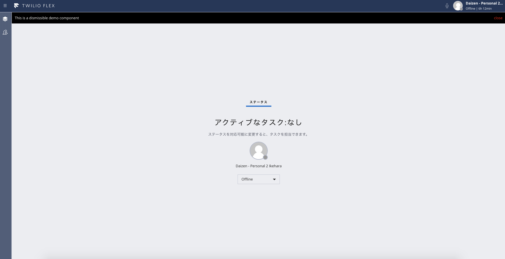
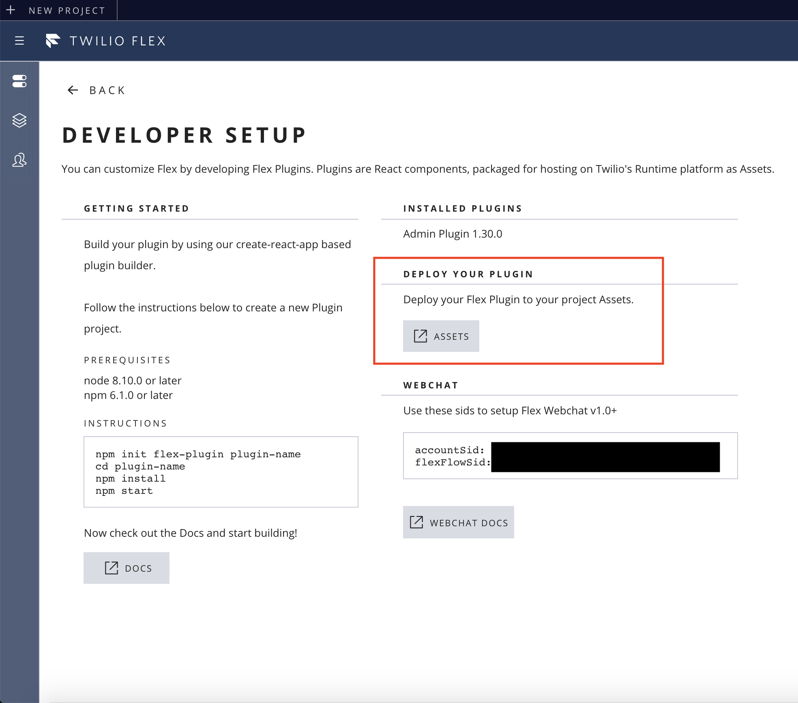
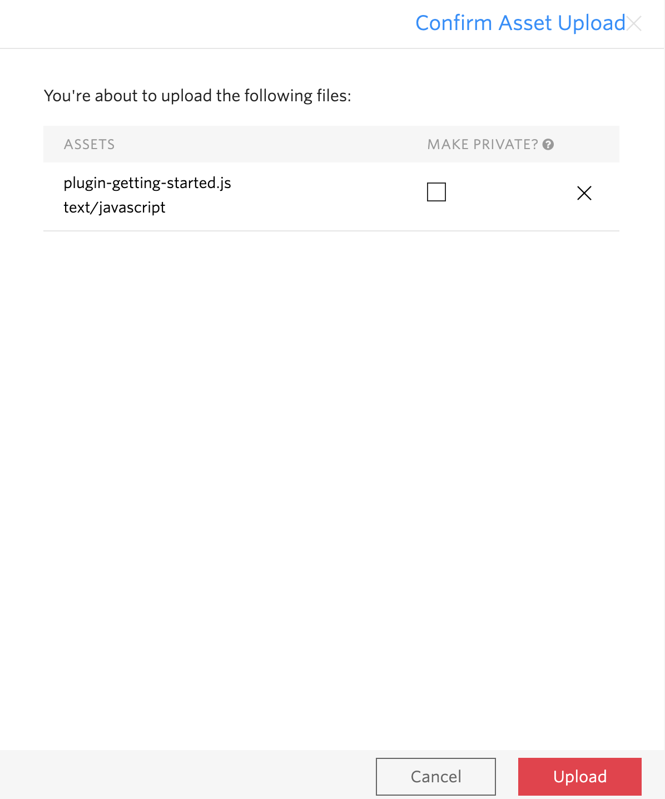
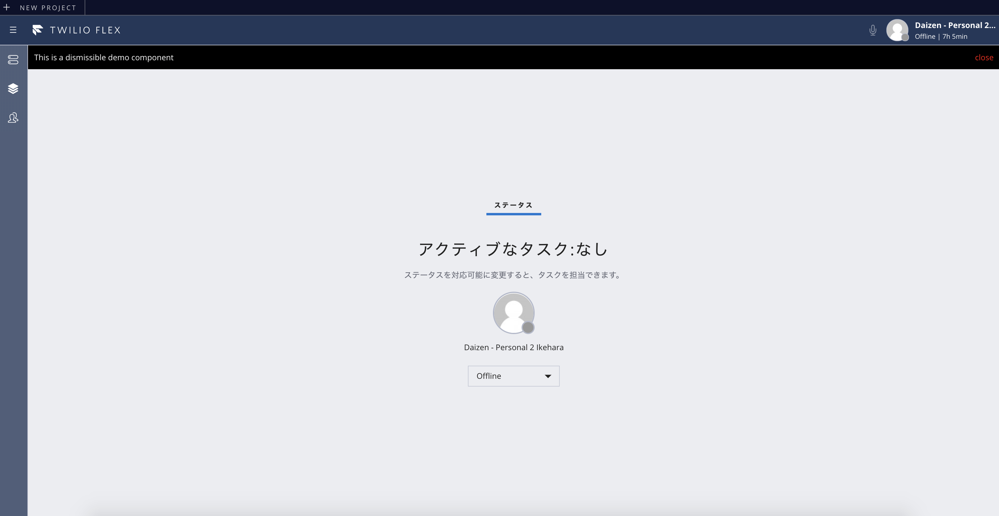

#  手順3: パネルの非表示とプラグインのデプロイ方法
## はじめに
この手順では標準のレイアウトとして提供されているパネルの表示・非表示を制御し、さらにローカル環境からFlexにプラグインをデプロイする方法を学習します。

## 3-1. 右パネルを非表示に設定

あらかじめ定義されている右パネルを非表示にする場合は、__GettingStartedPlugin.js__ を開き、__init__ メソッドで、引数として渡される __flex__ の __AgendDesktopView.defaultProps.showPAnel2__ を __false__ に設定します。

```js
  init(flex, manager) {

    // 右パネルを非表示とする。
    flex.AgentDesktopView.defaultProps.showPanel2 = false;

    //省略...

  }
```

保存し、右パネルが消えていることを確認してください。




## 3-2. 作成したプラグインをデプロイし、プロダクションで実行

ローカル環境でカスタマイズしたプラグインをプロダクトションに反映させる場合は、クラウド側にデプロイする必要があります。そのため、ターミナルから次のコマンドを実行し、プロジェクトをビルドします。

```
npm run build
```

ビルドが完了すると、buildフォルダにプラグインの名前がついたjsファイルが作成されます。このファイルをクラウド側にアップロードする形になります。

flex.twilio.com をブラウザーで開きます。サインイン画面が表示された場合は、画面下部の __Login with Twilio__ をクリックし、Twilioアカウントでサインインします。

続いて、__DEVELOPER SETUP__ の __EDIT__ ボタンをクリックします。


__DEPLOY YOUR PLUGIN__ セクションの __ASSETS__ ボタンをクリックすると、別のタブが開き、Assets画面が表示されます。ここで __Add an Asset__ をクリックし、先ほど作成したプラグインファイルをアップロードします。



アップロード確認のダイアログが表示されますが、__MAKE PRIVATE__ のチェックが外れていることを確認してください。
__Upload__ ボタンをクリックし、アップロードを完了させます。



アップロード完了後、__flex.twilio.com__ をリロードし、プロダクションにプラグインが適用されたことを確認します。
この際、正しく反映されていない場合は、ブラウザーキャッシュのクリアや再読み込みを試してください。




## 関連リソース

- [Deploying Flex Plugins](https://jp.twilio.com/docs/flex/deploying-plugins)


## 次の手順
[手順4: カスタムコンポーネントを追加](./02-04-CustomComponents.md)
