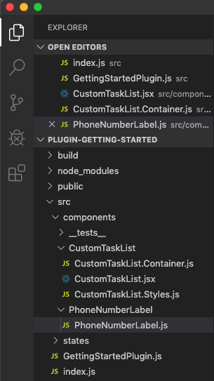
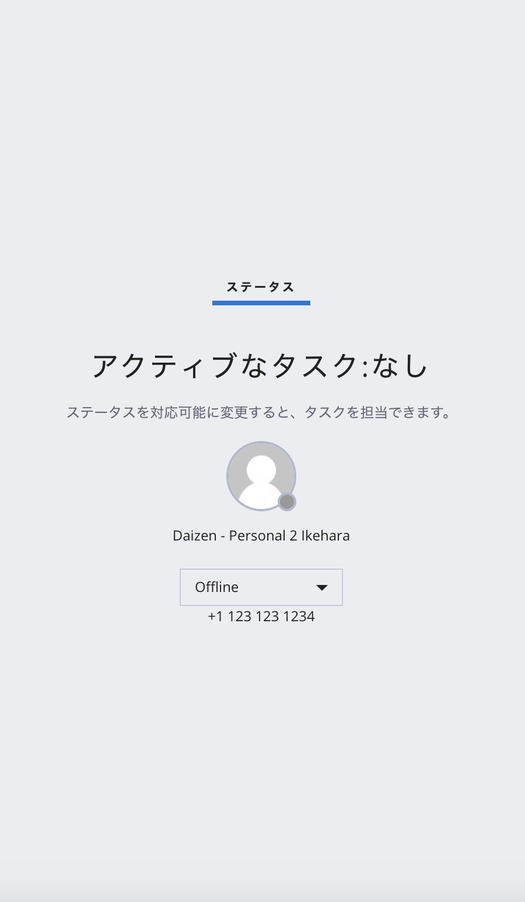

#  手順4: カスタムコンポーネントを追加
## はじめに
この手順では標準のUIに追加のUI要素（コンポーネント）を追加する方法をご紹介します。Flexで提供されているUIの詳細は下記の図の通りです。


今回は、__NoTasksCanvas__ に自分自身の電話番号を追加します。

## 4-1. PhoneNumberLabelフォルダ、PhoneNumberLabel.jsファイルを作成

__src - components__フォルダにPhoneNumberLabelフォルダを作成し、さらに、PhoneNumberLabel.jsファイルを作成します。




このファイルの中身を下記のコードを参考に電話番号を表示する項目を作成してください。

```js
import React from 'react';

const PhoneNumberLabel = (props) => {
  return (
      <div>
        +1 123 123 1234
      </div>
  );
};

export default PhoneNumberLabel;

```

## 4-2. 作成したコンポーネントを追加

__GettingStartedPlugin.js__ を開き、PhoneNumberLabelをインポートします。

```js
import PhoneNumberList from '/components/PhoneNumberList/PhoneNumberList';
```

次に __init__ メソッドで引数の __flex__ を用いてコンテンツに先ほど作成した __PhoneNumberLabel__ を追加します。

```js
  init(flex, manager) {
    
    // 省略

    flex.NoTasksCanvas
      .Content
      .add(<PhoneNumberLabel key="phone-number-label" />);
  }
```

保存し、電話番号が表示されていることを確認してください。



## 4-3. コンポーネントに動的な値を設定

先ほどは固定の番号を表示していましたが、動的な値を表示してみましょう。[Flex Manager](https://www.twilio.com/docs/flex/flex-manager)には現在サインインしているユーザーの情報（__UserInfo__）にアクセスできる __user__ プロパティからユーザーの役割を渡します。

__GettingStartedPlugin.js__ を開き、__init__ メソッドで __PhoneNumberLabel__ を追加しているコードを変更し、__userRole__ を渡します。

```js
  init(flex, manager) {
    
    // 省略

    flex.NoTasksCanvas
      .Content
      .add(<PhoneNumberLabel key="phone-number-label"
            userRole={manager.user.roles}  /> );
  }
```

次に __PhoneNumberLabel__ を変更します。

```js
import React from 'react';

// It is recommended to keep components stateless and use redux for managing states
const PhoneNumberLabel = (props) => {
  return (
    <div>
      {props.userRole}
    </div>
  );
};

export default PhoneNumberLabel;
```
保存し、現在のロールが表示されることを確認してください。

このように実行時の情報に応じてコンポーネントに表示する情報を動的に設定することができます。

## 関連リソース

- [Components - add,replace, and remove](https://www.twilio.com/docs/flex/components-add-replace-modify)


## 次の手順
[手順5: イベントの利用](./02-05-Events.md)
