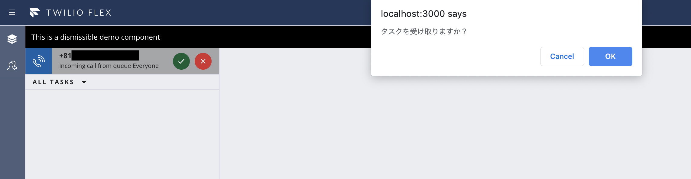

#  手順5: イベントの利用
## はじめに
Flexにはさまざまなイベントが用意されており、[Flex Actions framework](https://www.twilio.com/docs/flex/actions-framework)を利用しこれらのイベントフックしカスタムロジックを組み込むことができます。この手順ではタスクを受け取る際に確認ダイアログを表示させる方法を学習します。

## 5-1. AcceptTaskイベントをフック

問い合わせが入った際にタスクを受け取り、自分にアサインするイベントとして __AcceptTask__ が用意されています。このイベントには受け取る直前に発生する __beforeAcceptTask__ イベントと、タスクを受け取った直後に発生する __afterAcceptTask__ イベントが用意されています。

確認ダイアログを表示させる場合は、アサインをキャンセルするシナリオも考えられるため、__beforeAcceptTask__ イベントをフックします。

__GettingStartedPlugin.js__ を開き、__init__ メソッドに次のコードを追加します。
```js
  init(flex, manager) {

    //省略...

    // イベントをフック
    flex.Actions.addListener("beforeAcceptTask", (payload, abortFunction) => {
        if (!window.confirm("タスクを受け取りますか？")) {
            abortFunction();
        }
    });
  }
```

問い合わせが入り、タスクを受け取る際に確認ダイアログが表示されることを確認してください。



## 5-2. 独自イベントを追加

__Flex Actions framework__ では独自イベントを登録し利用することもできます。その場合は、__registerAction__ メソッドを使用し登録し、さらに __invokeAction__ メソッドで呼び出します。

__GettingStartedPlugin.js__ を開き、__init__ メソッドに次のコードを追加します。
```ts
  init(flex, manager) {

    //省略...

    //独自イベントを定義
    flex.Actions.registerAction("MyAction", (payload) => {
      flex.AudioPlayerManager.play({
        url: "https://api.twilio.com/cowbell.mp3",
        repeatable: false
      });
    });

    //タスク完了時にイベントを呼び出し
    flex.Actions.addListener("afterCompleteTask", (payload) => {
      return flex.Actions.invokeAction("MyAction")
    });
  }
```

問い合わせの後処理が完了した段階で指定したサウンドが流れることを確認してください。他にリソースがあればそちらを指定いただいても構いません。

## 関連リソース

- [Flex Actions framework](https://www.twilio.com/docs/flex/actions-framework)
- [Sounds in Flex and Audio Player Manager API ](https://www.twilio.com/docs/flex/audio-player)

## 次の手順
[手順6: カスタムビューをFlexに追加する](./02-06-CustomView.md)
