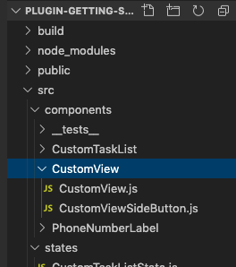
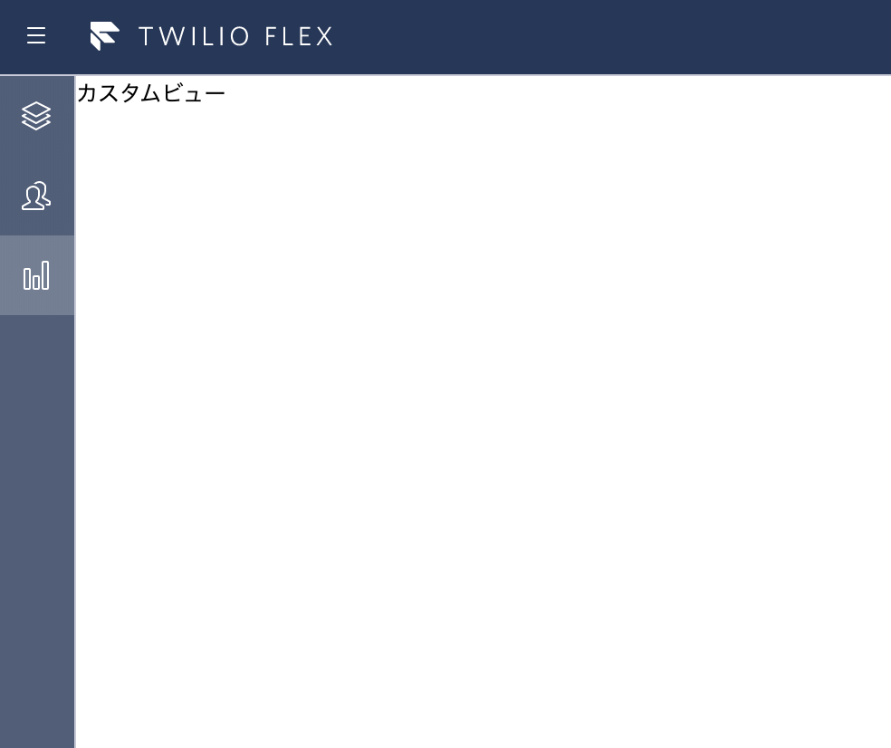

#  手順6: カスタムビューを追加
## はじめに
この手順では標準では提供されていない新規のUI（ビュー）をFlexに追加する方法を学習します。

## 6-1. CustomViewフォルダ、CustomView.js、CustomViewSideButton.jsファイルを作成

__src - components__フォルダにCustomViewフォルダを作成し、CustomView.js、CustomViewSideButton.jsファイルを作成します。




## 6-2. CustomView.jsでReactコンポーネントを定義

カスタムビューの中身はReactコンポーネントそのものです。
下記のコードを参考に実装してください。

```js
import React from 'react';

export default class CustomView extends React.Component {
    render() {
        return (
          <div>カスタムビュー</div>
        );
    }   
}
```

## 6-3. サイドバーに表示するボタンを作成

サイドバー用にこのカスタムビューを呼び出すためのボタンを作成します。__CustomViewSideButton.js__ を開き、下記のコードを参考にボタンを実装してください。

```js
import React from 'react';
import {SideLink, Actions} from '@twilio/flex-ui';

const CustomSidebarButton = ({ activeView}) => {
    // custom-viewと名前がついたビューへ遷移
    function navigate () {
        Actions.invokeAction('NavigateToView', {viewName: 'custom-view'});
    }

    return (
        <SideLink
            showLabel = {true}
            icon = "Data"
            iconAction = "DataBold"
            isActive = {activeView === 'custom-vuew'}
            onClick = {navigate}
        >
            カスタムビュー
        </SideLink>
    )
}

export default CustomSidebarButton
```

## 6-4. サイドバーにボタンを追加

サイドバーに先ほど作成したボタンを追加するため、__GettingStartedPlugin.js__ を開き、__View__、CustomView、CustomViewSideButtonをインポートします。

```js
import { View } from '@twilio/flex-ui';
import CustomView from './components/CustomView/CustomView';
import CustomViewSideButton from './components/CustomView/CustomViewSideButton';
```

そして __init__ メソッドで引数の __flex__ を用いて __SideNav__ のコンテンツに先ほど作成した __CustomViewSideButton__、__CustomView__ を追加します。

```ts
  init(flex, manager) {
    
    // 省略

    //サイドバーにボタンを追加
    flex.SideNav.Content.add(
      <CustomViewSideButton key="custom-view-button" />
    );

    //カスタムビューを含んだViewをコレクションに追加
    flex.ViewCollection.Content.add(
      <View name="custom-view" key="custom-view">
        <CustomView></CustomView>
      </View>
    );
  }
```

保存し、サイドバーにボタンが追加されたこと、さらにクリックするとカスタムビューが表示されることを確認してください。



このカスタムビューには任意のコンテンツを追加できるため、独自のUIやAPIを用いた外部システムとの連携などを実装できます。
ぜひ、色々と追加してみてください。

## 関連リソース

- [Create Custom Views and Routes](https://www.twilio.com/docs/flex/custom-views-and-routes)
- [Twilio Flexドキュメント](https://www.twilio.com/docs/flex)
- [Twilio Flexカスタマイズ動画（英語）](https://www.youtube.com/watch?v=r5jMRtmoHaw&list=PLqrz4nXepkz4wXHPRc1NdPEajPJ8cbNKI)

## 追加のチュートリアル（英語）
- [Overriding Flex UI themes, branding and styling ](https://www.twilio.com/docs/flex/overriding-themes-branding-and-styling)
- [Add Task and Theme Context to Components](https://www.twilio.com/docs/flex/ui/add-component-context)
